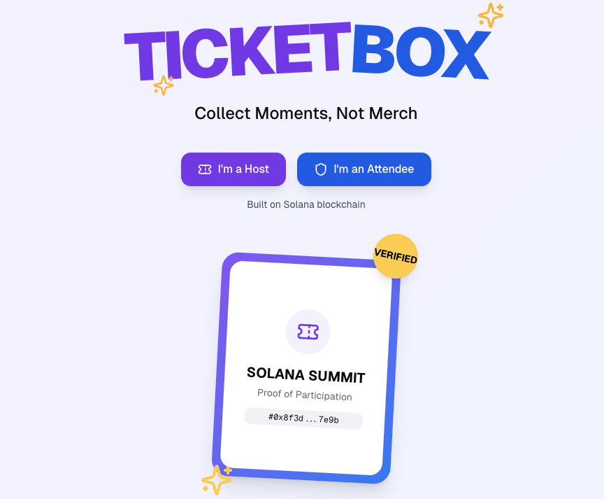

# TicketBox monorepo

# TicketBox
A Proof of Participation (PoP) NFT dispenser built on top of [ZK-Compression](https://www.zkcompression.com/).

## TicketBox includes:
- TicketBox Protocol:
    - A zk-NFT standard inspired by the [Metaplex Core](https://developers.metaplex.com/core) standard.
    - TicketBox: A zk-NFT dispenser protocol. Think of it like the [Metaplex Candy Machine](https://developers.metaplex.com/candy-machine), but for zk-NFTs.
- TicketBox Platform:
Built on top of the TicketBox Protocol, this no-code tool allows event creators to easily create events and distribute zk-NFTs to users. Attendees can easily collect a Proof of Participation NFT by scanning a QR code.

## MVP Features
- zk-NFT: Create NFTs and collections.
- Ticketbox Dispenser: Create a ticketbox for events. Allows attendees to mint zk-NFTs.
- Admin Site: Enables event creators to create events. Each event is assigned a unique QR code.
- Attendee App (PWA): Allows attendees to claim and manage their zk-NFTs. Users can scan a QR code to claim NFTs.

## Roadmap
- zk-NFT: Finalize the zk-NFT standard.
- Ticketbox Dispenser:
    - Complete the remaining features.
    - Generalize the system beyond PoP use cases.
    - Add support for guards (access control).
- Admin Site: Implement the remaining features.
- Attendee App:
    - Integrate passkey for easier onboarding.
    - Add support for alternative claiming methods such as location-based and secret code claiming.
    - Moments Feature: Allow attendees to take photos during the event, post them, and earn small rewards.
    - Proof of Interaction: When two attendees interact, the system records the interaction and rewards both users.

